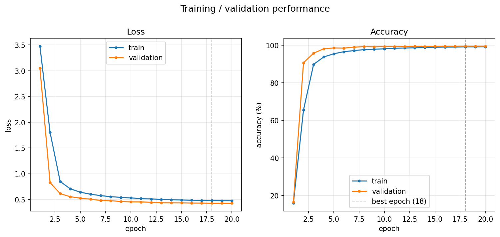
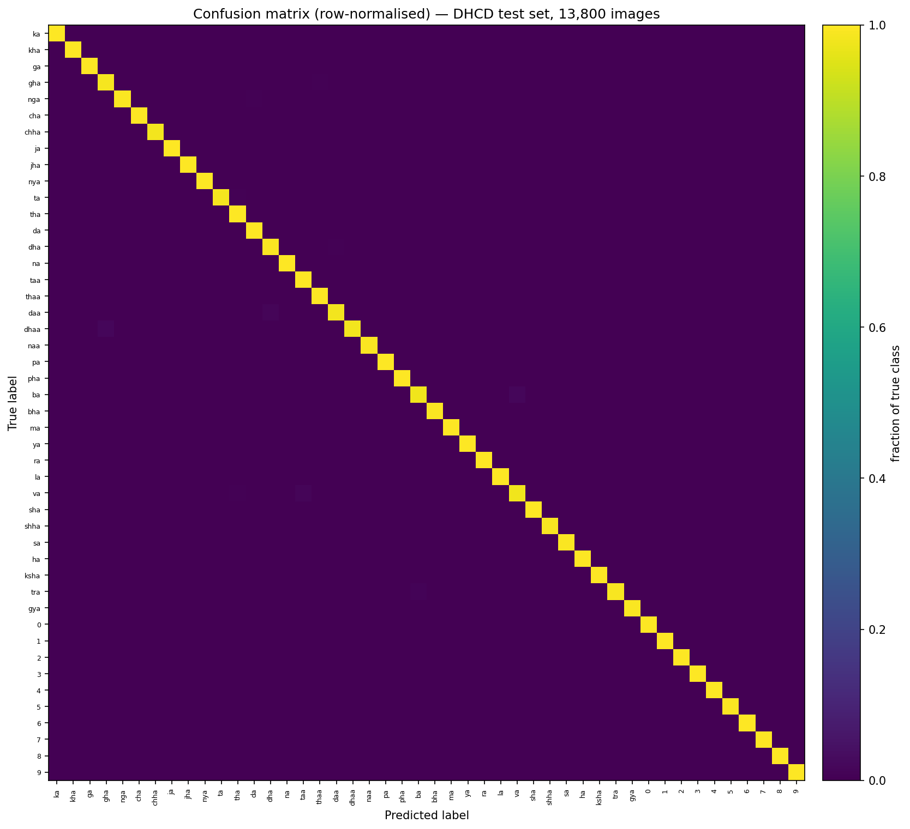
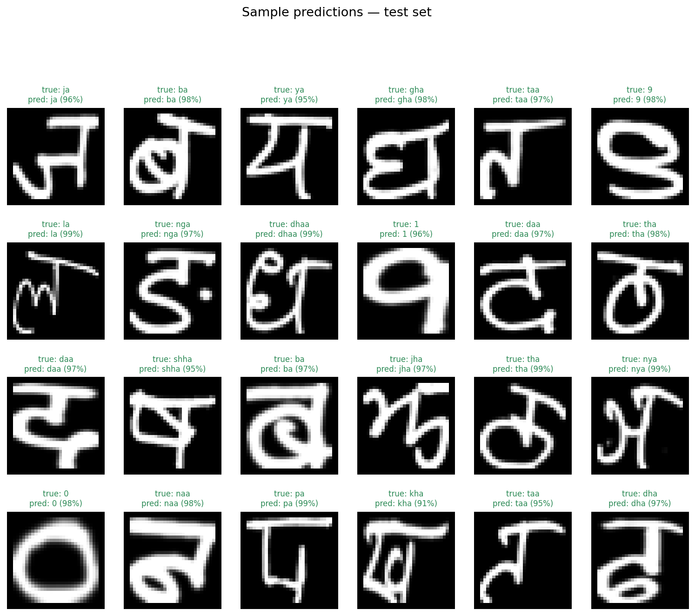
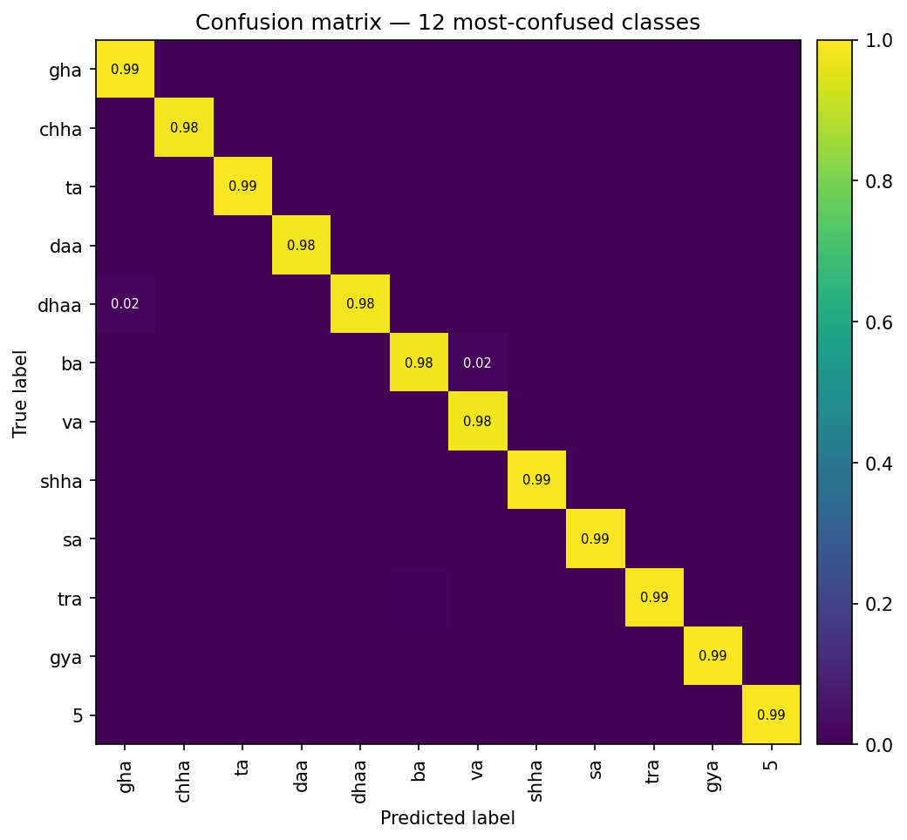
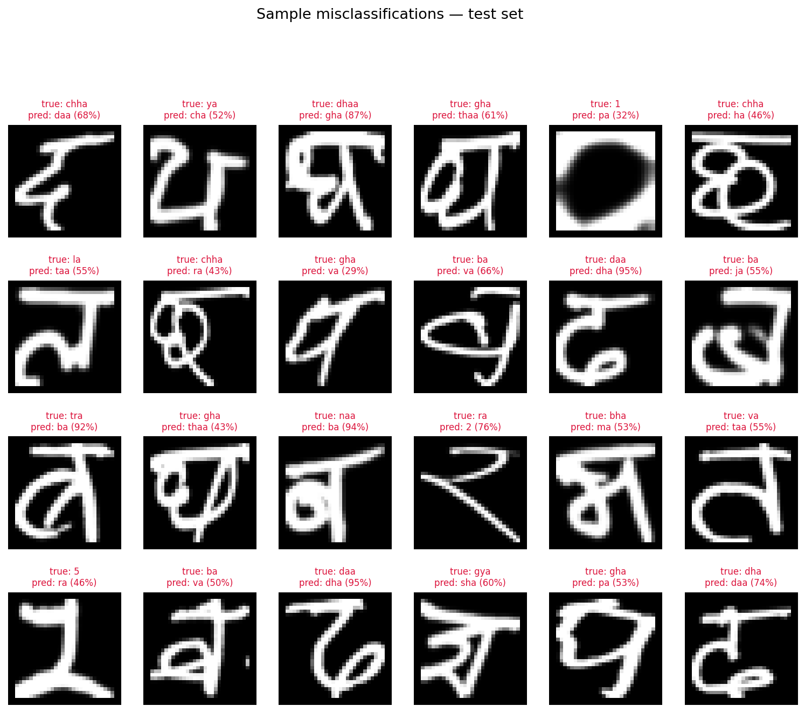
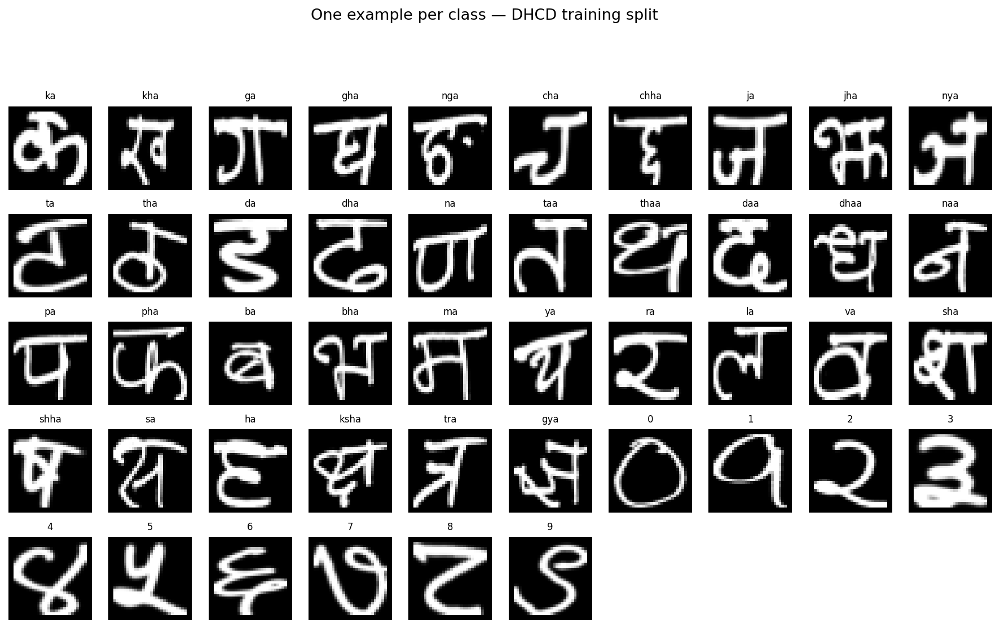

# Sanskrit (Devanagari) Character Recognition with a CNN

A PyTorch convolutional neural network that classifies handwritten Sanskrit
(Devanagari-script) characters — 36 consonants and 10 digits, 46 classes in
total — built end-to-end: dataset acquisition, preprocessing, a stratified
train/validation/test split, model training, and evaluation with accuracy,
precision, recall, F1-score and a confusion matrix.

**Test-set accuracy: 99.48%** on 13,800 held-out, unseen images (46 classes).

| Metric (unseen test set, n=13,800) | Score |
|---|---|
| Accuracy | 99.48% |
| Precision (macro) | 99.48% |
| Recall (macro) | 99.48% |
| F1-score (macro) | 99.48% |
| Precision (weighted) | 99.48% |
| Recall (weighted) | 99.48% |
| F1-score (weighted) | 99.48% |





## Dataset

[**DHCD — Devanagari Handwritten Character Dataset**](https://github.com/Prasanna1991/DHCD_Dataset)
(Acharya, Pant & Gyawali, *SKIMA* 2015).

* 92,000 grayscale images, 32×32 pixels, **46 classes**: 36 consonants
  (क–ज्ञ) + 10 digits (०–९).
* Each class has 2,000 handwritten samples, contributed by school students in
  Bhaktapur, Nepal, then scanned and processed by the original authors.
* Devanagari is the script Sanskrit is written in, and this is the largest
  clean, publicly-labeled Devanagari character image set available, which is
  why it is used here in place of a smaller, less-curated "Sanskrit-only" set.
* Ships as a single `dataset.npz` with an **official train/test split**
  (78,200 / 13,800 images) so the test set is guaranteed to be unseen during
  training.

```
@inproceedings{acharya2015deep,
  title={Deep learning based large scale handwritten Devanagari character recognition},
  author={Acharya, Shailesh and Pant, Ashok Kumar and Gyawali, Prashnna Kumar},
  booktitle={9th Int'l Conf. on Software, Knowledge, Information Management and Applications (SKIMA)},
  year={2015}
}
```

## Project structure

```
sanskrit-cnn/
├── src/
│   ├── config.py       # paths, hyperparameters, class-name tables
│   ├── data_prep.py     # download + preprocess + train/val/test split
│   ├── dataset.py        # torch Dataset / DataLoader + augmentation
│   ├── model.py            # the CNN architecture
│   ├── train.py              # training loop, checkpointing, history
│   ├── evaluate.py             # accuracy / precision / recall / F1 / confusion matrix
│   ├── visualize.py              # all figures (curves, confusion matrix, samples)
│   ├── predict.py                   # classify a new, unseen image file
│   └── utils.py                        # seeding, device, small helpers
├── samples/             # example PNGs (one per class) for predict.py demos
├── outputs/
│   ├── models/          # trained checkpoint (sanskrit_cnn_best.pt)
│   ├── metrics/         # JSON/CSV metrics, classification report, raw predictions
│   └── figures/         # PNG plots referenced above
├── requirements.txt
└── README.md
```

## Setup

```bash
git clone <this-repo-url>
cd sanskrit-cnn
pip install -r requirements.txt
```

Requires Python 3.10+. Works on CPU (used to produce the results in this
README); a CUDA or Apple-MPS GPU is used automatically if available.

## Pipeline

Run the five stages in order. Each stage reads the previous stage's output
from `data/` or `outputs/` — nothing is hard-coded across scripts.

```bash
# 1. Download DHCD, preprocess (grayscale, 32x32, normalize), stratified split
python src/data_prep.py

# 2. Train the CNN (checkpoints the best validation-accuracy model)
python src/train.py                       # override e.g. --epochs 30 --batch-size 256

# 3. Evaluate on the held-out, unseen test set
python src/evaluate.py

# 4. Generate all plots (training curves, confusion matrix, prediction grids)
python src/visualize.py

# 5. Classify a new image
python src/predict.py samples/00_ka_0.png
```

## Preprocessing

* **Grayscale** — images are single-channel; a generic RGB→grayscale step in
  `data_prep.py` handles datasets that aren't already grayscale.
* **Resize** — every image is forced to 32×32 (DHCD already ships at this
  size, so this step is a safety net, not a real resize, for this dataset).
* **Normalize** — pixel values scaled to [0, 1] then standardised with the
  training split's own mean/std (computed once in `data_prep.py`, stored in
  `config.py` so train/val/test all use the *training* statistics).
* **Split** — the official 78,200-image DHCD training pool is further split
  90/10 into train/validation with `sklearn.model_selection.train_test_split`
  (`stratify=labels`, `random_state=42`), so every class keeps its share in
  both splits. The official 13,800-image test set is never touched until
  `evaluate.py` — it is the "unseen" data referenced throughout.
* **Augmentation** (training split only) — small random affine
  transforms (±8° rotation, ±8% translation, 92–108% scale, 5° shear) via
  `torchvision.transforms`, to model natural handwriting variation without
  distorting a character into a different one.

## Model

`SanskritCNN` (`src/model.py`) — a compact VGG-style CNN, ~430K trainable
parameters:

| Block | Layers | Output |
|---|---|---|
| Input | — | 1×32×32 |
| Block 1 | [Conv3×3–BN–ReLU]×2 → MaxPool2 → Dropout 0.25 | 32×16×16 |
| Block 2 | [Conv3×3–BN–ReLU]×2 → MaxPool2 → Dropout 0.30 | 64×8×8 |
| Block 3 | [Conv3×3–BN–ReLU]×2 → MaxPool2 → Dropout 0.35 | 128×4×4 |
| Head | AdaptiveAvgPool(2) → Flatten → Linear(512,256) → BN → ReLU → Dropout 0.5 → Linear(256,46) | 46 logits |

Trained with AdamW, a `OneCycleLR` schedule, label smoothing (0.05), gradient
clipping, and early stopping on validation accuracy (patience 6 epochs). Full
hyperparameters are in `src/config.py` and `outputs/metrics/train_summary.json`.

## Results

Trained for 20 epochs (~83 minutes on a 2-core CPU); the checkpoint from
**epoch 18** had the best validation accuracy and is what's evaluated below
and shipped in `outputs/models/sanskrit_cnn_best.pt`.

| Split | Images | Accuracy |
|---|---|---|
| Train | 70,380 | 99.18% |
| Validation | 7,820 | 99.48% |
| **Test (unseen)** | **13,800** | **99.48%** |

On the unseen test set: precision, recall and F1 (macro- and weighted-average)
all land at **99.48%**, matching accuracy almost exactly — a sign the 46
classes are balanced (300 test images each) and no class is being
systematically favored or ignored.

The five hardest classes are visually similar letter pairs — e.g. **va** (व)
vs. **ba** (ब)/**taa** (त), and **gha** (घ) vs. **tha/thaa** (थ) — the kind of
confusion a human reader would also make on rushed handwriting:

| Class | F1-score | Support |
|---|---|---|
| va (व) | 0.975 | 300 |
| ba (ब) | 0.978 | 300 |
| gha (घ) | 0.983 | 300 |
| daa (द) | 0.987 | 300 |
| taa (त) | 0.987 | 300 |

Full per-class precision/recall/F1 is in
[`outputs/metrics/classification_report.txt`](outputs/metrics/classification_report.txt);
raw numbers backing every figure are in `outputs/metrics/*.json`.

### Training / validation curves


### Confusion matrix

Row-normalised, full 46×46 matrix, plus a zoomed-in view of the classes the
model confuses most often (visually similar Devanagari letterforms, e.g.
retroflex vs. dental consonants):




### Sample classification results

Green titles are correct predictions, red are mistakes:




### Dataset preview



## Reproducibility

* `SEED = 42` fixes Python / NumPy / PyTorch RNGs (`src/utils.py::set_seed`).
* Train/val split, normalisation statistics, and model init are all
  seeded, so re-running `data_prep.py` → `train.py` reproduces this README's
  numbers to within normal floating-point / CPU-thread-scheduling variance.

## Limitations

* DHCD is a Devanagari *script* dataset (it includes Nepali as well as
  Sanskrit usage of the script) rather than a Sanskrit-manuscript-specific
  corpus; no large, cleanly-labeled Sanskrit-only character image set with a
  standard train/test split is publicly available at the time of writing.
  The character set (36 consonants + 10 digits) is exactly the Devanagari
  alphabet used to write Sanskrit.
* Trained on isolated, pre-segmented single characters — not full manuscript
  pages, so it does not perform line/character segmentation.

## License

MIT — see [LICENSE](LICENSE).
